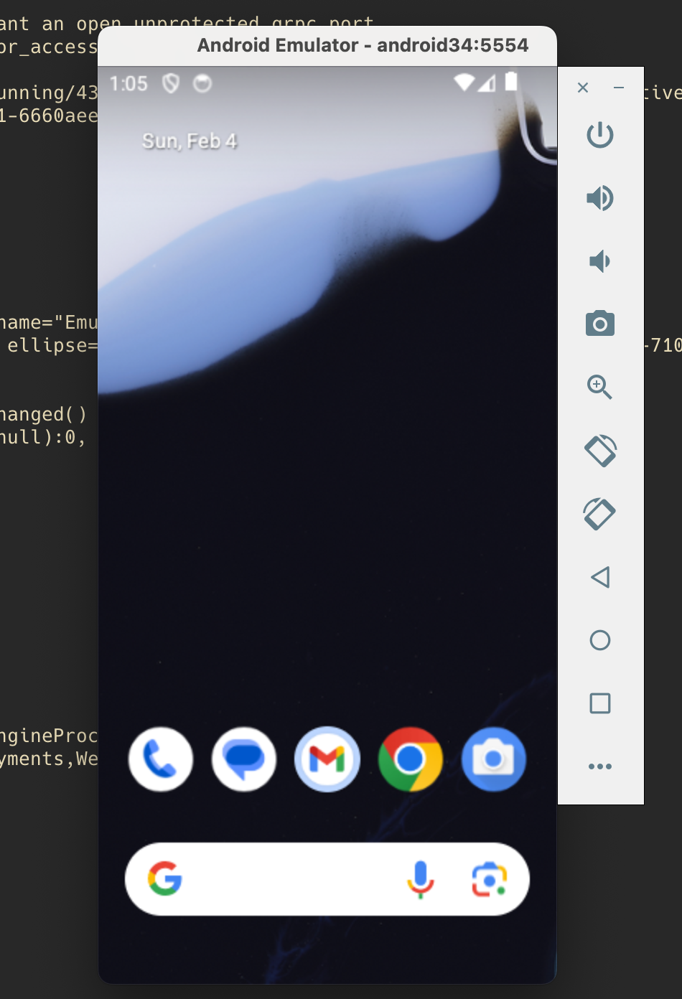

# Android Virtual Device without Android Studio

Guide for configuring Android Virtual Device(AVD) on macOS using command line.

Start with [Homebrew](https://brew.sh/) installation if you do not have that
installed.

## Installation

First, make sure that `openjdk` is installed. If not, install most recent
release with following command.

```
brew install java
```

The next step is to install android command line tools with following command.

```
brew install android-commandlinetools
```

Installing [android-commandlinetools](https://developer.android.com/tools) package
will add several artifacts to the path `/opt/homebrew/share/android-commandlinetools/`.
And, among those artifacts is a tool called [sdkmanager](https://developer.android.com/tools/sdkmanager) that
can be used to manage Android Software Development Kit(SDK), platform
images and other build tools.

## Download emulator and tools

Once the `sdkmanager` binary is configured correctly, it can be used to download
the `emulator` and `platform-tools` as follows.

```
sdkmanager emulator platform-tools
```

## Setup environment variables

After the downloads are completed, setup `ANDROID_SDK_ROOT` environment variable
as follows and add following directories to `$PATH` to access executable files
from command line.

```
export ANDROID_SDK_ROOT="/opt/homebrew/share/android-commandlinetools/"
export PATH="/opt/homebrew/share/android-commandlinetools/emulator:$PATH"
export PATH="/opt/homebrew/share/android-commandlinetools/platform-tools:$PATH"
export PATH="/opt/homebrew/share/android-commandlinetools/build-tools/34.0.0:$PATH"
```

## Download packages

### Android API Level 34
- Download SDK for API level 34
    ```
    sdkmanager "platforms;android-34"
    ```
- Download Android build tools for API level 34
    ```
    sdkmanager "build-tools;34.0.0"
    ```
- Download Android system image for API level 34 and arm64 build
    ```
    sdkmanager "system-images;android-34;google_apis;arm64-v8a"
    ```

## Create an Android Virtual Device

```
avdmanager create avd --name mydevice --package "system-images;android-34;google_apis;arm64-v8a"
```

## Start Android Virtual Device
```
emulator -avd mydevice
```



## Interact with device

Check if you can reboot Android Virtual Device with [adb](https://developer.android.com/tools/adb) command.

```
adb reboot
```
